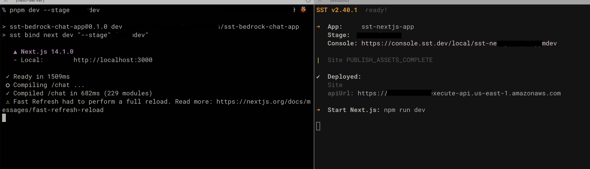

# SST and Bedrock Chat app

This is a basic chat app using [AWS Bedrock](https://aws.amazon.com/bedrock/) as the GPT provider (is that thing?)

The [SST Framework](https://sst.dev) is a set of high level [CDK constructs](https://docs.aws.amazon.com/cdk/v2/guide/home.html) and a CLI that makes creating and maintaining apps on AWS a breeze 🌬️

I'm using [NextJS](https://nextjs.org/docs) as the frontend with [Tailwind CSS](https://v2.tailwindcss.com/docs).

## Prerequisites

This app assumes a working knowledge of NodeJS, ReactJS, AWS resources, APIs and SDKs.

If you have not worked with SST before follow one of the [getting started tutorials](https://docs.sst.dev/) in their docs, otherwise you might find this app difficult to understand.

This app was created with the following:

- Node v20.11.0
- pnpm 8.15.1
- AWS CLI

See [package.json](./package.json) for versions of other software

You will need an AWS account and to have configured the [AWS CLI](https://docs.aws.amazon.com/cli/latest/userguide/getting-started-install.html) for [sso login](https://docs.aws.amazon.com/cli/latest/userguide/sso-configure-profile-token.html#sso-configure-profile-token-auto-sso)

## Getting Started

Clone the repo and run install

```bash
git clone git@github.com:rujmah/sst-bedrock-chat-app.git
cd sst-bedrock-chat-app
pnpm i
```

## AWS Bedrock Set up

To run this app you will need to visit your [AWS Bedrock console](https://docs.aws.amazon.com/bedrock/latest/userguide/model-access.html) and allow access to the following models:

- Amazon Titan Lite `amazon.titan-text-lite-v1`
- Meta Llama 2 Chat 13B `meta.llama2-13b-chat-v1`

## Running the app locally

Open two terminal shells, one for the NextJS app and the other for the SST backend.

For the SST backend:

```bash
pnpm sst dev --stage dev
```

For the NextJS app:

```bash
pnpm dev --stage dev
```

> Note on `--stage dev` these are flags to let SST know what stage it is working on. Read more in their docs. But, I would advise you to use different stages for different dev modes, like `local-dev`, `dev-deploy`, `production`, etc.

Once, the NextJS and SST apps are running you should see something like this:



You can then visit the app at http://localhost:3000


## Deploying the app

Ensure you have run `aws sso login` or have used another method to configure AWS command line access.

```bash
pnpm sst deploy --stage production
```

This will deploy the app and give you endpoints for the app and api.

Again, you can change the `--stage production` to whatever you so desire or need.

## Removing the app

To save money and resources, you can remove the apps you have deployed by using the following command:

```bash
pnpm sst remove --stage production
```

## Models

This app uses two models as mentioned above. These were selected for speed and testing. You can play around with adding more, but be aware that different models expect different inputs and return different outputs.

See the lambda [titan](./src/lambda/titan.ts) and [llama](./src/lambda/llama.ts) code for the expected inputs of each respective model.

The docs on the schemas are, at time of writing, are hard to find. Will update this document when I find more consistent documentation.

## Redux

I have settled on [Redux](https://redux.js.org/) [Toolkit](https://redux-toolkit.js.org/) for the frontend app state management.

Redux makes maintaining state a lot simplier and allows for much, _much_, better separation of React components. The toolkit is an amazing improvement on the piles of boilerplate code you needed write in the past.

If you've given up on it a while ago, I heartly recommend another look.

## Other Bedrock capabilities

Bedrock contains many different tools - the biggest deal being "Agents" IMHO - and is extending the toolbox further as I type. As an experienced AWS technical consumer I find this very exciting and am playing with as many as I can.

This repo is obviously a fairly simple chat app as a starting point. Hope you enjoy it and it helps you on your AI journey.

Safe Travels 🫡 🚀
